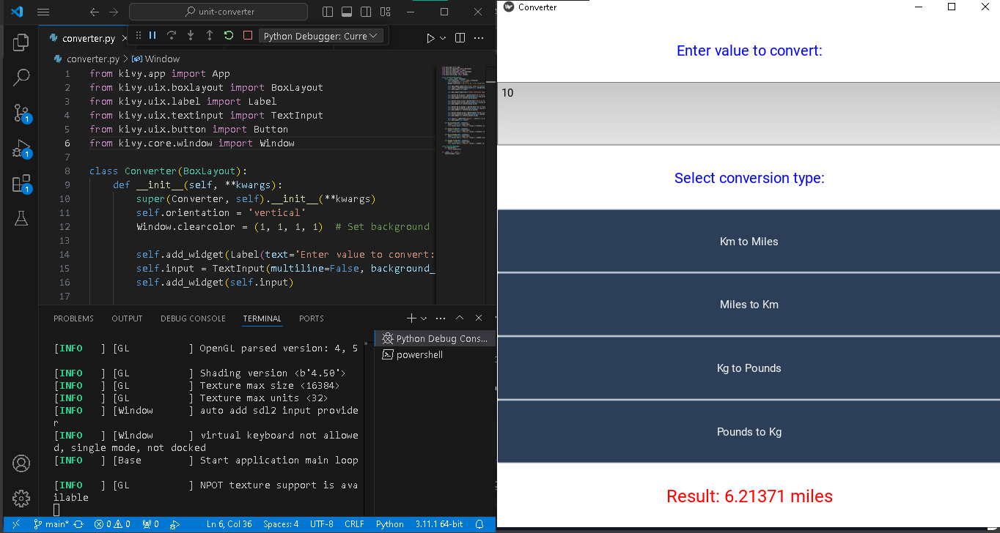

markdown

# Units-Convert


## Overview
Units-Convert is a cross-platform application designed to convert units between the imperial and metric systems. This application is built using the Kivy framework and supports conversions like kilometers to miles, kilograms to pounds, and more.

## Features
- Convert Kilometers to Miles and vice versa
- Convert Kilograms to Pounds and vice versa
- User-friendly interface with colorful design

## Installation
1. Clone the repository:
   ```bash
   git clone https://github.com/Vkrmoo7/Units-Convert.git
Navigate to the project directory:

bash
cd Units-Convert
Install the required packages:

bash
pip install kivy
Usage
Run the converter.py script to start the application:

bash
python converter.py

Screenshots

Contributing
Feel free to fork this repository and make your own changes. Contributions are welcome!

License
This project is licensed under the MIT License - see the LICENSE file for details.


### Logos
To add the programming language logos, I used badges from [shields.io](https://shields.io/). The Python badge shows the version compatibility.

#### Adding a Screenshot
Don't forget to add a screenshot to the `Screenshots` section. Save your screenshot in the project directory and replace `path_to_your_screenshot_image.png` with the actual path to your image file.

### Steps to Include README in GitHub
1. **Create the README.md File:** 
   - Open VS Code.
   - Create a new file named `README.md`.
   - Copy the above content into the `README.md` file.

2. **Add the README.md File:**
   ```bash
   git add README.md
